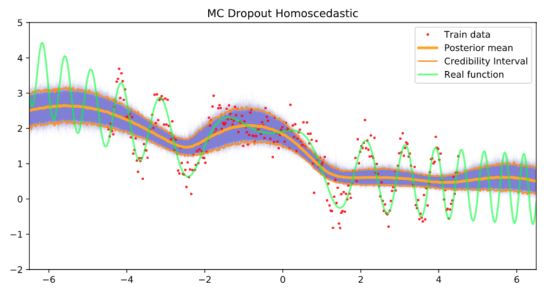
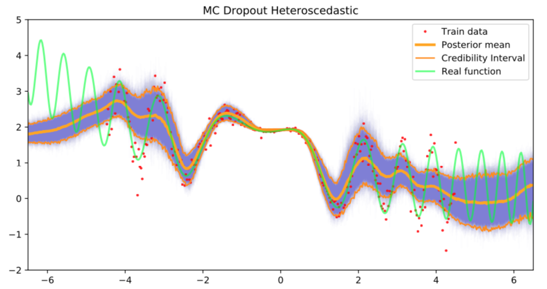

# Bayesian-Deep-Learning-Clarotto-Franchini-Lamperti
In this project we aim at comparing a Bayesian Neural Network trained with Hamiltonian Monte Carlo and a MC Dropout Neural Network focusing on regression and reinforcement learning problem. We used the library Pytorch.


## Table of contents
* [Installation guide](#installation-guide)
* [The architecture of the network](#The-architecture-of-the-network)
* [Comparison of results](#Comparison-of-results)
* [Reinforcement Learning](#Reinforcement-Learning)
* [Inspiration](#inspiration)
* [Contact](#contact)

## Installation guide

In the _bayes_reg.py_ implementation we used an external package called  *hamiltorch* which we used to train the NN with the Hamiltonian MC method. To install it you have to execute the following commands:

git clone https://github.com/AdamCobb/hamiltorch.git

```python

import foobar

cd hamiltorch

pip install .
```


## The architecture of the network

The process of coding and analysing the Bayesian Neural Network and the Neural Network with Dropout is composed of different steps:

1. Train theBayesianNN with Hamiltonian MonteCarlo with the library Hamiltorch;
2. Train the NN with dropout with homoscedastic and heteroscedastic dropout (p = 0.7, i.e 30% of missing nodes); 
3. Find the architecture of the Neural Network in which each method works best;
4. Test the two methods on the same function 
 
                                     f (x) = sin(3(x + 2) − (x + 2)^2) + exp(−0.2x)


We choose to maintain the same number of layers (2 hidden layers) and the same activation functions (_sin_ for the first layer, _ReLU_ for the second layer).

The only variable that changes between the two nets is the number of nodes in each layer. We aim at using two nets which give the results in almost the same time. The architecture that makes the duration of the training similar is a Bayesian NN with 5 nodes in each layer and an NN with Dropout with a much larger number of nodes in each layer (300 nodes). We must consider that a part of those are switched off during each forward pass (only 70% of them contribute to the network).

## Comparison of results

**Homoscedastic and heteroscedastic residuals**

In the Neural Network with dropout, it’s necessary to choose which type of residuals must be used. We test the network with both homoscedastic residuals and heteroscedastic residuals.

If we use homoscedastic residuals, we fix the variance for all data to sigma^2=(0.3)^2, so that the training data have the exatly same design as in the bayesian NN. Instead, if we choose to have heteroscedastic residuals, the variance depends on the variability of data. The residuals are learnt during the training process.

<p float="left">
  
  
</p>

