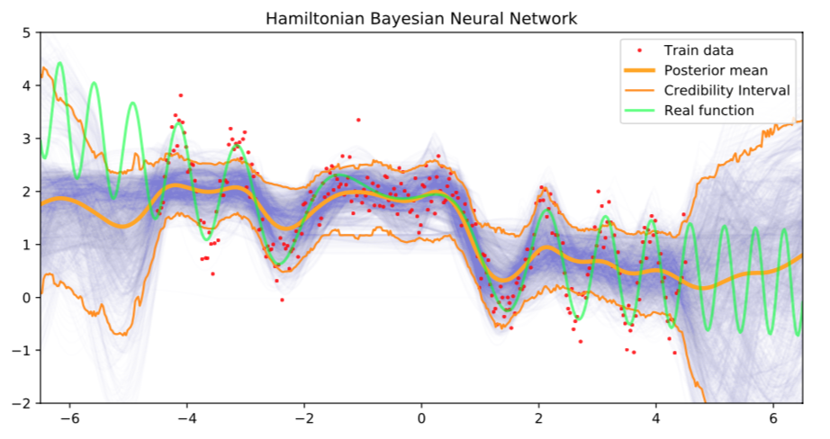
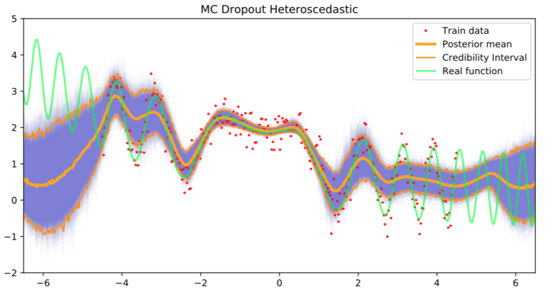
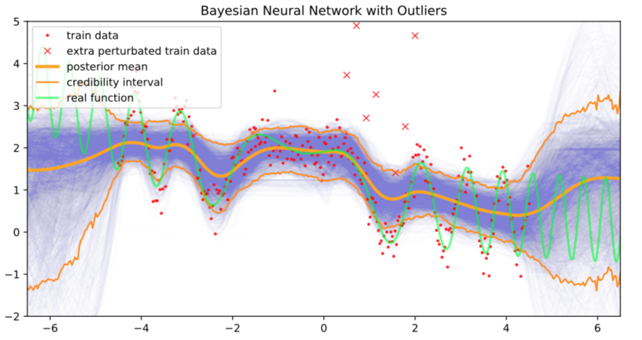
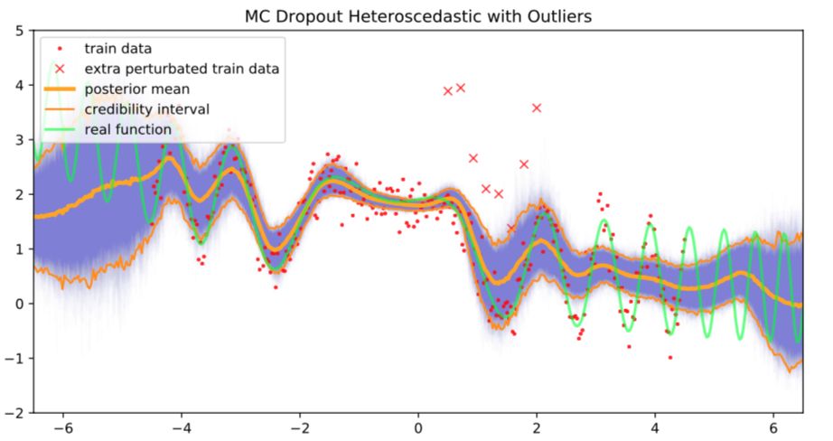
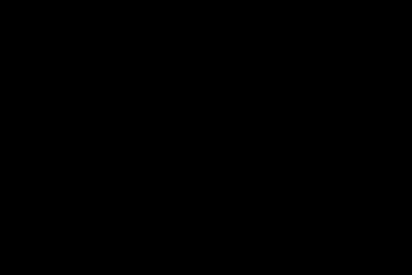
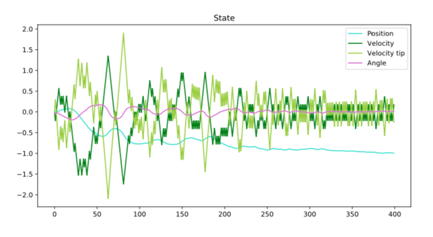
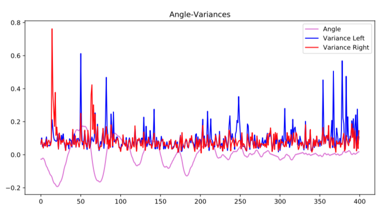
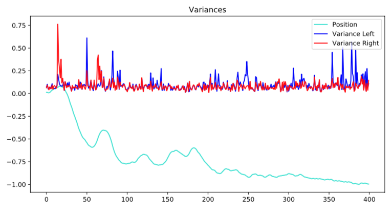
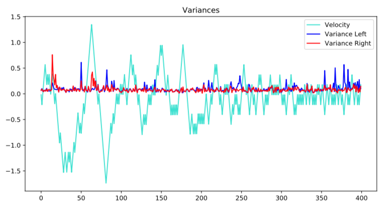

# Bayesian-Deep-Learning-Clarotto-Franchini-Lamperti
In this project we aim at comparing a Bayesian Neural Network trained with Hamiltonian Monte Carlo and a MC Dropout Neural Network, focusing on regression and reinforcement learning problem. We used the library ```Pytorch```.


## Table of contents
* [Structure](#structure)
* [Installation guide](#installation-guide)
* [The architecture of the network](#The-architecture-of-the-network)
* [Comparison of results](#Comparison-of-results)
* [Reinforcement Learning](#Reinforcement-Learning)
* [Inspiration](#inspiration)

## Structure
Some useful hints about our Github.
In [Papers](https://github.com/Alessandro-Franchini/Bayesian-Deep-Learning-Clarotto-Franchini-Lamperti/tree/master/Project/Papers) you will find the bibliography used in the study.

In [Regression Study](https://github.com/Alessandro-Franchini/Bayesian-Deep-Learning-Clarotto-Franchini-Lamperti/tree/master/Project/Regression_study) folder you will find the following codes, all regarding the regression with Neural Networks with a Bayesian approach: 

* [MC_Dropout_homo](https://github.com/Alessandro-Franchini/Bayesian-Deep-Learning-Clarotto-Franchini-Lamperti/blob/master/Project/Regression_study/MC_Dropout_homo.py) - Neural Network with Homoscedastic MC dropout
* [MC_dropout_hetero](https://github.com/Alessandro-Franchini/Bayesian-Deep-Learning-Clarotto-Franchini-Lamperti/blob/master/Project/Regression_study/MC_dropout_hetero.py) - Neural Network with Heteroscedastic MC dropout
* [Bayesian_NN](https://github.com/Alessandro-Franchini/Bayesian-Deep-Learning-Clarotto-Franchini-Lamperti/blob/master/Project/Regression_study/Bayesian_NN.py) - Hamiltonian Bayesian Neural Network.

In [qlearning](https://github.com/Alessandro-Franchini/Bayesian-Deep-Learning-Clarotto-Franchini-Lamperti/blob/master/Project/Qlearning) folder you will find the following codes:

* [qlearning_cartpole_dropout](https://github.com/Alessandro-Franchini/Bayesian-Deep-Learning-Clarotto-Franchini-Lamperti/blob/master/Project/Qlearning/qlearning_cartpole_dropout.py) - where you will find qlearning simulation with Dropout (the Cartpole problem)
* [post_prod](https://github.com/Alessandro-Franchini/Bayesian-Deep-Learning-Clarotto-Franchini-Lamperti/blob/master/Project/Qlearning/post_prod.py) - where you will find post production (plots and analysis)

Moreover, you will find some files .csv (and the .gif files, equally named) corresponding to previously run simulations of qlearning (if you want just to plot results without running a new simulation)

## Installation guide

In the _bayes_reg.py_ implementation we used an external package called  ```hamiltorch``` which we used to train the NN with the Hamiltonian MC method. To install it you have to execute the following commands:


```
git clone https://github.com/AdamCobb/hamiltorch.git
cd hamiltorch
pip install .
```


## The architecture of the network

The process of coding and analyzing the Bayesian Neural Network and the Neural Network with Dropout is composed of different steps:

1. Train the BayesianNN with Hamiltonian MonteCarlo with the library Hamiltorch;
2. Train the NN with dropout with homoscedastic and heteroscedastic dropout (p = 0.7, i.e 30% of missing nodes); 
3. Find the architecture of the Neural Network in which each method works best;
4. Test the two methods on the same function 
 
                              f (x) = sin(3(x + 2) − (x + 2)^2) + exp(−0.2x)


We choose to use the same number of layers (2 hidden layers) and the same activation functions (_sin_ for the first layer, _ReLU_ for the second layer).

The only variable that changes between the two nets is the number of nodes in each layer. We aim at using two nets which give the results in almost the same time. The architecture that makes the duration of the training similar is a Bayesian NN with 5 nodes in each layer and an NN with Dropout with a much larger number of nodes in each layer (300 nodes). We must consider that a part of those are switched off during each forward pass (only 70% of them contribute to the network).

## Comparison of results

**Homoscedastic and heteroscedastic residuals**

In the Neural Network with dropout, it’s necessary to choose which type of residuals must be used. We test the network with both homoscedastic residuals and heteroscedastic residuals.

If we use homoscedastic residuals, we fix the variance for all data to  σ= 0.3^2, so that the training data have the exatly same design as in the bayesian NN. Instead, if we choose to have heteroscedastic residuals, the variance depends on the variability of data. The residuals are learnt during the training process.


If we look at the results of the neural network, we see that the uncertainty varies a lot in the two cases. When the dropout is applied with homoscedastic residuals, the uncertainty is underestimated, especially when the function becomes periodic. When the residuals are heteroscedastic and are learnt during the training phase, we remark a higher uncertainty where the function is periodic.


<p float="left">
  
  
</p>


**Fitness and uncertainty - Bayesian NN vs. Heteroscedastic dropout**

Maybe the most important comparison to mention is the one between the two methods. We look at the goodness of the fit and at the uncertainty given by the credibility intervals computed on the samples of the neural network.

The Bayesian NN gives good results. Even if the function is not perfectly predicted, the uncertainty is very good, especially outside the training area: in fact, all the function is included between the credibility interval curves (94% CI). The MC dropout gives almost perfect predictions and null uncertainty in U(x = 0), but underestimates the uncertainty out of the central part, especially where the function is periodic.


<p float="left">
  
  
</p>

From these considerations, we can say that the two methods are good for this Bayesian regression problem with the setting we’ve chosen. We must remark that the Bayesian Neural Network has far less nodes, making it a poorer architecture, hence its capacity to estimate the good output and the uncertainty is remarkable. On the other side, as we’ve already mention, we try to focus on the time of training and, in this case, the two methods are equivalent, so that the results can be correctly compared. In any case, the two methods give satisfactory results.

**Fitness and uncertainty - Bayesian NN vs. Heteroscedastic dropout**

The last comparison we do is about the resilience of the networks when some outliers are added. We aim at seeing what is the method that better works when some wrong data form the training dataset. We test the two networks with 8 outliers inserted be- tween 0.5 and 2, all randomly selected around y = 2 with σ = 0.3.


<p float="left">
  
  
</p>

From the simulations we remark that the Bayesian Neural Network tends to follow the outliers and the entire curve is higher in the area where they have been added. The curve is flattened around the mean, especially where the function is periodic. Heteroscedastic dropout also gets worse in its performances, but maintain the predicted output almost aligned with the correct function. Moreover, it’s interesting to notice that we can play on the dropout probability in order to have some particular performances. We know, for example, that by increasing the number of nodes to be switched off, we can reduce overfitting and be more confident on the credibility interval. This is a good quality for this type on Neural Network.


Overall we are proud of the results of the two methods on this type of regression task. It would be interesting to focus on a real dataset and obtain a similar comparison in a scenario where the estimation of the uncertainty linked to the regression could be useful for concrete tasks.

## Reinforcement Learning

We try to train and test the cartpole problem, through the two different methods: ε- greedy algorithm and implicit Thompson sampling (via dropout). We discuss only the dropout approach, since it’s the one which deals with a Bayesian approach.

Thanks to the introduction of this sampling procedure, we can analyze the variance of choosing to go right or left at each passage from one state to the next one. In this way we may detect the states where the cartpole is more sure about its following decision and the ones where the uncertainty is higher.


<p align="middle">
  
</p>

In the following figure, we first plot the 4 variables that characterize every state (position, velocity, angle and velocity of the tip). It’s a good way to visualize the evolution of the system and it allows to see if there are states which differ from the majority.
General plot of the states reached by the cartpole during an episode of the training:

<p f align="middle">
  
</p>

Then we plot the variance with some of the variables of the state, in order to see if some particular states are linked to some particular points of the evolution of the variance.

General plot of the angles reached by the cartpole during an episode of the training and the corresponding variance (of going left and right):

<p align="middle">
  
</p>


If we look at figures above, we can see that the variance of the decision the neural network makes is linked with the values of the angle that the pole makes with respect to the cart. We can clearly see that at t = 22, when the pole is strongly tilted towards the left (high negative angle), the variance of the cart decision to go right, which will make the system survive longer, is much less then the variance of the cart decision to go right. It seems that the net understands the fact that if the angle is negative, it must go to the right, otherwise the uncertainty of going to the left is much higher. This insight can be used to make the training even more efficient, since by looking at the uncertainties, we can have a clue of what the net has learned about the phenomenon.

General plot of the positions reached by the cartpole during an episode of the training and the corresponding variance (of going left and right): 
<p align="middle">
  
</p>

General plot of the velocity and the velocity of the tip reached by the cartpole during an episode of the training and the corresponding variance (of going left and right):
<p align="middle">
  
</p>
The plots concerning the other 3 state variables (positions, velocity and velocity of the tip) are less representative of the evolution of the variance. We report them too, since an in-depth study could bring up some interesting features we’ve not found.

## Inspiration
Adam Cobb https://adamcobb.github.io 

Javer Antoran https://github.com/JavierAntoran/Bayesian-Neural-Networks

Documentation on Q-learning  https://github.com/hzxsnczpku/banrinochoujou/blob/master/doc/hw.pdf


